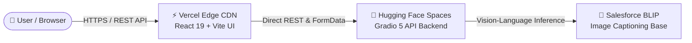

# ✨ SnapScribe — AI Image Caption Generator

[](https://snapscribe-ai.vercel.app)
[](https://snapscribe-pro.vercel.app)
[](https://react.dev)
[](https://huggingface.co/spaces/vardhanmit6/SnapScribe-AI-Image-Caption)
[](LICENSE)

> **Professional AI-powered image captioning** built with a modern, glassmorphic **React 19 Frontend** deployed on **Vercel** and powered by a high-performance **Salesforce BLIP Vision Model** running on **Hugging Face Spaces**.

---

## 🌐 Live Production Deployments

Experience SnapScribe instantly without installing anything. Try our live web applications:

| Deployment | URL | Status | Description |
| :--- | :--- | :---: | :--- |
| 🌟 **Primary Custom URL** | **[https://snapscribe-ai.vercel.app](https://snapscribe-ai.vercel.app)** | 🟢 **ACTIVE** | Brand-customized production Vite + React UI |
| 💎 **Pro Custom URL** | **[https://snapscribe-pro.vercel.app](https://snapscribe-pro.vercel.app)** | 🟢 **ACTIVE** | Secondary professional alias for instant access |
| ⚡ **Original Vercel URL** | **[https://web-cyan-sigma-42.vercel.app](https://web-cyan-sigma-42.vercel.app)** | 🟢 **ACTIVE** | Direct Vercel pipeline CDN deployment |
| 🤗 **AI Backend Space** | **[Hugging Face Space](https://huggingface.co/spaces/vardhanmit6/SnapScribe-AI-Image-Caption)** | 🟢 **ACTIVE** | Python Gradio API hosting the BLIP neural network |

---

## 🏗️ Architecture & Features

SnapScribe is architected as a decoupled, modern enterprise web application:



### ✨ Core Features:
- 📸 **Universal Image Upload** — Drag & drop or click to upload any JPEG, PNG, or WebP visual.
- ⚡ **Dual Caption Generation** — Instantaneous generation of both concise 1-sentence overviews and rich, multi-sentence detailed descriptions.
- 🛡️ **Industrial Network Resilience** — Features a hybrid **Direct REST API Engine (`Method 1`)** with auto-retries that bypasses corporate proxy/VPN (Zscaler/Netskope) streaming restrictions.
- 🎨 **Premium Glassmorphic UI** — Deep obsidian dark mode with neon indigo accents, interactive micro-animations, and responsive layout.
- 📋 **One-Click Copy & Export** — Instantly copy generated captions to clipboard for social media, SEO, or e-commerce cataloging.

---

## 🛠️ Technology Stack

### Frontend (`web/` directory)
- **React 19** & **Vite 8** — Ultra-fast frontend rendering and bundling.
- **Vanilla CSS3** — Tailored design system with custom CSS tokens, glassmorphism, and responsive breakpoints.
- **Lucide React** — Modern vector icon library.
- **Vercel Engine** — Automated root-level deployment forwarding (`vercel.json` & root `package.json`).

### Backend (`hf-space/` directory)
- **Python 3.10+** & **GTorch / PyTorch** — Deep learning model execution.
- **Salesforce BLIP** (`blip-image-captioning-base`) — State-of-the-art vision-language transformer.
- **Gradio 5.x** — Robust REST API and Server-Sent Events (SSE) inference backend.

---

## 🚀 Local Development

### 1. Run the React Frontend Locally
```bash
# Clone the repository
git clone https://github.com/Vardhan-Mittal/SnapScribe-AI-Image-Caption.git
cd SnapScribe-AI-Image-Caption/web

# Install dependencies
npm install

# Start local dev server
npm run dev
```
The React frontend will start at `http://localhost:5173`.

### 2. Run the AI Backend Locally (Optional)
```bash
cd hf-space
pip install -r requirements.txt
python app.py
```
The Gradio API server will launch at `http://localhost:7860`.

---

## 📁 Repository Structure

```
SnapScribe-AI-Image-Caption/
├── web/                   # ⚡ React 19 Frontend Web App (Vercel)
│   ├── src/               # UI components, App.jsx, and direct REST API client
│   ├── package.json       # Frontend dependencies
│   └── vercel.json        # SPA routing rules
├── hf-space/              # 🤗 AI Backend Service (Hugging Face Space)
│   ├── app.py             # Gradio API & BLIP inference server
│   └── requirements.txt   # Backend Python dependencies
├── vercel.json            # 🔧 Root forwarding config for Vercel GitHub builds
├── package.json           # 🔧 Root package scripts for seamless CI/CD
├── LICENSE                # 📜 MIT License
└── README.md              # 📖 This documentation
```

---

## 🤝 Contributing & License

This project is open-source and released under the terms of the **[MIT License](LICENSE)**.
You are free to use, modify, and distribute this software for personal and commercial applications.

---
✨ Built with ❤️ by **[Vardhan Mittal](https://github.com/Vardhan-Mittal)** · Powered by Salesforce BLIP & Vercel
